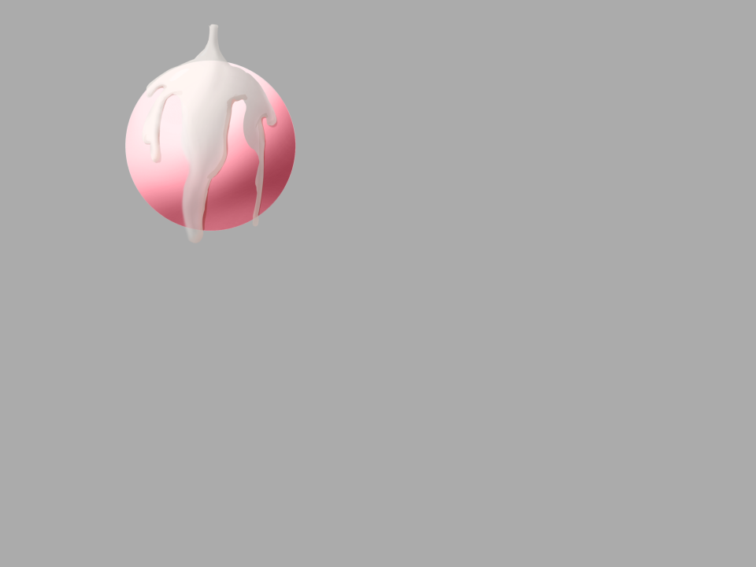
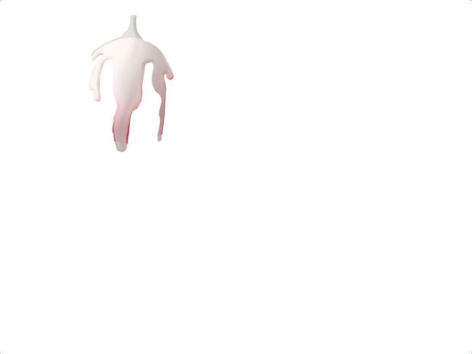
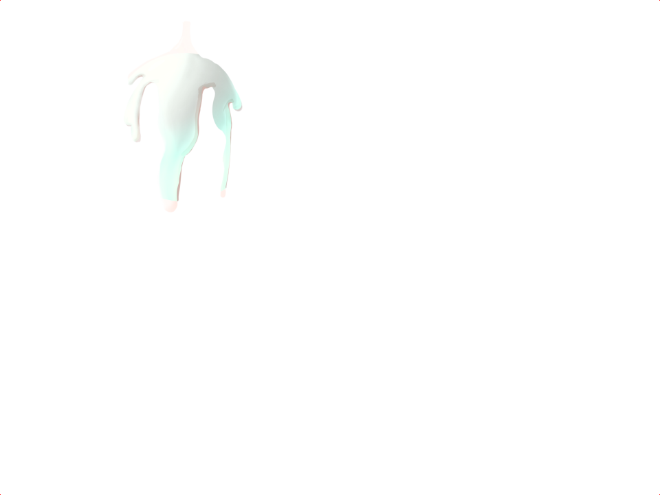
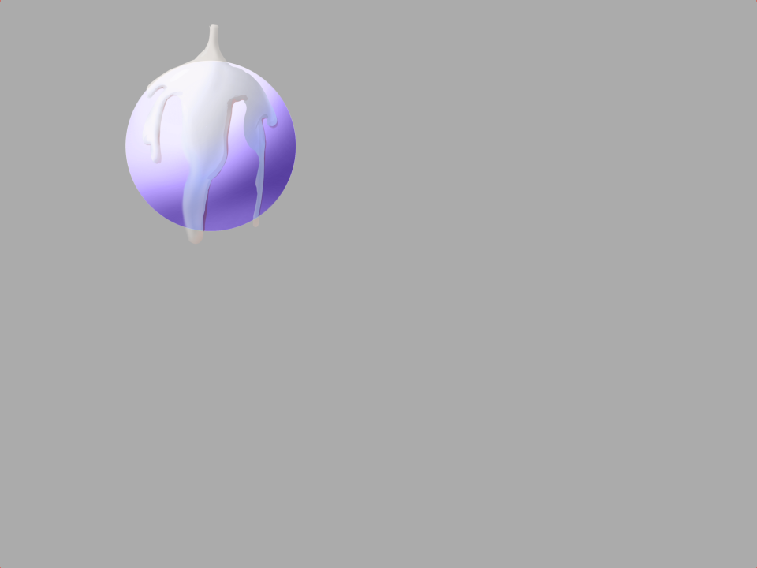

# DiffGet · 图片差异提取工具

把两张**相邻帧**的差异提取成一张**带 alpha 的图层 PNG**：把它叠加回「背景图片」，
**逐像素精确还原「提取图片」**。双击 `run.bat` 即用，页面在 <http://127.0.0.1:9426>。

典型用途：把某一帧里多出来的特效层（水花、粒子、光效）单独抠成图层，
再叠到别的帧、或重绘后的底图上。

## 特性

- **像素级比较**：任一通道差值 > 容差即算差异（容差默认 0 = 任何差异都提取）
- **一次写出两张**：`<名字>.png`（羽化素材图层，默认 1px 边缘羽化）＋ `<名字>_原始.png`（原色提取，硬边）
- **叠加还原是数学恒等式**：默认路径实测复合误差 **0.00**，与差异大小无关
- **两种算法**：默认「原色提取 + 边缘羽化」；可选旧版「半透明归因」（un-blending 反解，输出上百档 alpha）
- **大图多进程**：≥400 万像素自动启用，任何并行异常自动回退单进程
- 结果先入缓存、**7 天自动删除**；一键永久保存到 `out\`
- **纯本地运行**：不联网、不上传任何图片
- 自带 `selftest.py`：合成夹具自检 28 项，不需要任何外部素材

## 效果展示

一对 3936×2952 的真实跑图结果：灰底上一颗粉色球，目标帧里球上多了一坨白色流挂、受光也变了。

> `docs\` 里放的是这些图的 **960×720 预览版**（原图在 `out\`，3936×2952）。
> 缩放走的是**预乘 alpha**（先乘 alpha 再重采样、最后除回来），所以透明关系没被破坏——
> 直通 alpha 缩放会把透明区的颜色渗进可见像素，正好是本项目要避免的那类杂色。

| 背景图（图片B） | 目标帧（图片A） |
|:---:|:---:|
|  |  |

两者的差异约占 **2.8%** 的像素（全分辨率下是 323,716 个 / 2.79%，外接框 `[738, 125, 1446, 1267]`）。
两条算法路径的产出，都是保存到 `out\` 的原始文件、未做任何后期处理：

| 原色提取图（默认路径 · 硬边） | 半透明归因图（旧版路径 · 192 档 alpha） |
|:---:|:---:|
|  |  |

两张图叠回背景图都能还原目标帧，但成色完全不同（下列为 960×720 预览版的实测）：

| | 原色提取图 | 半透明归因图 |
|---|---|---|
| 叠回背景图的还原误差 max / p99 | 7.00 / 0.00 | 6.00 / 1.00 |
| 彩度 p90（图层可见像素；来源在这些像素上是 38） | **38** | **170** |
| 「alpha<16 且彩度≥200」的像素 | **2** | **216** |
| 半透明像素 | 1,604 | 19,586 |

> 全分辨率下原色提取图的还原误差是 **0.00 / 0.00**、alpha 只有 0/255 两档、极端色像素 **0** 个；
> 半透明归因图是 **2.00 / 1.00**、185 档 alpha、极端色像素 **6,490** 个。
> 预览版的误差来自重采样本身，不是算法问题。

右图那层**青绿色**就是这么来的：un-blending 把差异解成「极小 alpha + 极端色」，
这些像素在原来的粉球背景上几乎看不见，一换背景就透出来了。

放到**另一个背景**上（这里换成一颗紫球）——新背景从半透明处透出，白色流挂保持完整：



> 提取结果四角的 4×4 纯红标记是「四角定位像素」，用来在 Photoshop 里核对画布尺寸与对齐，
> 不参与差异统计；缩到 720p 后被稀释成约 1px 的红点，基本看不出来。

## ⚠ 使用前必读：画布尺寸

**在 Photoshop 里请直接打开「提取图片」作为画布，再把图层拖进去；
不要「新建文档」后拖入并缩放。**

图层是**按来源图像素**生成的，缩放会重采样 alpha 与颜色，凭空造出两幅图都没有的颜色。
实测（1920×1080 图层缩放到 5333×3000 后再叠回底图，「既不像来源也不像底图」的像素数）：

| 图层 | ×1.42 | ×2.7778 | 最大颜色偏离 |
|---|---|---|---|
| 原色提取（硬边） | 8,685 | **33,175** | 96 |
| 羽化 1px（默认） | 1,142 | 4,421 | 47 |
| 旧版半透明归因 | 297 | 1,151 | 68 |

**没有任何路径缩放后还是干净的**，所以正解只有一个：**保持 100% 尺寸、与原图对齐**。
输出图四角的 4×4 纯红标记就是给你核对尺寸与对齐用的。

## 快速开始

**双击 `run.bat`**（首次运行会自动安装依赖），浏览器访问 <http://127.0.0.1:9426>。

```bat
python web_app.py
```

## 页面使用说明

1. **两个图片框**：「提取图片（图片A）」是差异像素的颜色来源，「背景图片（图片B）」是对比基准。
   每张图都可以**拖拽**、点「选择图片…」、或**手动输入路径**后回车。
2. **参数**
   - 容差：0-255，默认 0（任何差异都提取）；调到 2-3 可滤掉时域噪点
   - 取色来源：差异像素取哪张图的颜色，默认图片A
   - 边缘羽化：0（硬边）/ **1（默认）** / 2 / 3
   - 杂色抑制：仅「半透明归因」开启时生效（关闭 / **标准** / 强）
   - 四角定位像素：默认开启，PS 里用来核对画布边界
   - 预览原色图：切换预览「羽化素材图层」还是「原色提取图」（保存时两张都写）
   - 半透明归因：**旧版算法，默认关闭**。开启后出现「透明判定」滑块，且「边缘羽化」「预览原色图」置灰
3. 点「⚡ 开始提取」，下方预览窗显示结果（棋盘格背景，可切纯黑/纯白/纯灰）
4. 统计：输出尺寸、差异像素、差异占比、耗时、计算引擎、差异外接框、半透明差异像素、文件大小
5. 「💾 保存到 out 目录」：常驻可见，提取成功后自动启用；文件名可自定义，重名自动加序号
6. 切换「半透明归因」后需**重新点一次「开始提取」**才生效

## 目录结构

```
diffget\
├─ run.bat            双击启动（自动检测 Python、装依赖、起服务、开浏览器）
├─ web_app.py         Web 服务（Flask，端口 9426）
├─ diff_core.py       差异提取核心（像素比较 + 羽化 / un-blending + 多进程）
├─ selftest.py        自检（合成夹具，python selftest.py）
├─ requirements.txt   依赖（flask / pillow / numpy）
├─ .gitignore
├─ static\index.html  单页前端（预览、背景切换、缩放平移）
├─ docs\              效果展示用图（960x720 预览版，README 引用这些）
├─ cache\             结果缓存（运行期生成，7 天自动删除，不入版本库）
└─ out\               永久保存目录（点"保存"后写入，不入版本库）
```

## 命令行用法

```bat
python diff_core.py 图片A.png 图片B.png -o 输出.png [--tolerance 5] [--source a|b]
                   [--workers 8] [--feather 1] [--plain-output 原色.png]
                   [--no-corner-markers] [--semi-attribution] [--transparency 100]
                   [--despeckle 1]
```

```bat
python diff_core.py a.png b.png -o diff.png
python diff_core.py a.png b.png --tolerance 5 --source b --workers 8
```

## 算法

### 默认：原色提取 + 边缘羽化

对每个像素比较两图 RGBA（任一通道差值 > 容差即算差异；两图在该像素都全透明时视为相同，
RGB 不参与比较）：

| 情形 | 输出 alpha | 输出颜色 |
|---|---|---|
| 差异像素，来源不透明 | **255** | 来源原色 |
| 差异像素，来源半透明 | **来源的 alpha** | 来源原色 |
| 差异像素，来源全透明 | 0 | — |
| 非差异像素 | 0 | — |

**为什么正确**：按 alpha 叠加回底图得 `out·A + (1-out)·B`。alpha=255 时恒等于来源原色；
alpha=来源 alpha 时恒等于来源图覆盖在底图上的外观。因此**叠加结果逐像素精确等于来源图**——
这是数学恒等式，与差异大小无关，**不可能产生杂色**：整条路径没有除法、没有颜色反解、
没有滤波替换。

实测（真实 1920×1080 连续两帧，容差 0）：

| 产出 | 复合还原误差 max / p99 | 误差 >8 的像素 | 彩度 p90（来源 40） | alpha 档位 |
|---|---|---|---|---|
| 原色提取（feather 0） | **0.00 / 0.00** | 0 | 40 | 2 |
| 羽化 1px（默认） | **0.00 / 0.00** | 0 | 41 | 3 |
| 羽化 2px | **0.00 / 0.00** | 0 | 41 | 4 |
| 羽化 3px | **0.00 / 0.00** | 0 | 41 | 5 |

**不变量**：差异掩码内任何真实帧间差 > 2 的像素，alpha 必须 ≥ 1（绝不允许出现空洞）。

### 边缘羽化（默认 1px）

二值掩码的直接边缘是硬边，放到新背景上会有锯齿。羽化在掩码**边界外侧**生成 alpha 渐变
（半径 R 时第 d 圈 `alpha = 1 - d/(R+1)`），颜色按**精确解族**反解
`C = B + (A - B) / alpha`——该式与复合方程 `alpha·C + (1-alpha)·B = A` 等价，
所以**羽化不破坏叠加还原**（上表误差全为 0.00）。

| 羽化半径 | 羽化环像素 | 环 alpha | 耗时（单进程 1920×1080） |
|---|---|---|---|
| 0（硬边） | 0 | — | 86 ms |
| 1（默认） | 44,097 | 128 | 129 ms |
| 2 | 72,083 | 85 / 170 | 139 ms |
| 3 | 95,173 | 64 / 128 / 191 | 147 ms |

两张产出在**掩码内部完全一致**（颜色 = 来源原色、alpha = 255），只有边界外侧的羽化环不同。
统计口径（差异像素数、外接框）始终按二值掩码计算，不含羽化环。

### 旧版：半透明归因（可选，默认关闭）

勾选后回到最初的 un-blending 路径：对每个差异像素求解 `(alpha, C)` 使
`alpha·C + (1-alpha)·底图 = 提取图` 成立，直接输出带 alpha 值的透明 PNG。

- 单通道方程在 `(alpha, C)` 下欠定，实现取"使 C 不越界的最小 alpha"，于是解出
  **极小 alpha + 极端颜色**
- 对**不透明源图**（普通截图）这等于把 1-2 级时域噪点放大 `1/alpha` 倍

实测（1920×1080 连续两帧游戏截图，容差 0；效果展示那对球的图规律相同，见上表）：

| 透明判定 t | 复合还原误差 max / p99 | 彩度 p90 | 半透明像素 | alpha 档位 | alpha<16 且彩度≥200 |
|---|---|---|---|---|---|
| 0（= 原色提取） | 0.00 / 0.00 | 40 | 0 | 2 | 0 |
| 50 | 1.00 / 1.00 | 43 | 396,728 | 128 | 0 |
| **100（完全归因）** | 2.00 / 2.00 | **230** | 362,545 | 250 | **42,632（可见像素的 11.6%）** |

读法：

- **叠回原底图，旧版也是精确的**（误差 ≤ 2）；彩点只在换到**别的**背景时才显形——
  那时图层里 11.6% 的可见像素是"极低 alpha + 极端色"，会把旧背景透成一团彩点
- 「杂色抑制」三档对它的改善有限（极端色像素 42,692 / 42,632 / 42,483），
  说明杂色来自"最小 alpha 解"本身，不是噪点，滤波压不掉
- 若素材必须放到别的背景上，正确的旋钮是「**透明判定**」滑块：它沿精确 alpha 解族抬高 alpha，
  **叠回原底图仍然精确**，只是让图层更不透明——这是唯一无损的调法

**为什么没有"去杂色 / 删像素"按钮**：一个像素向新背景注入的可见彩色永远不超过它真实帧间差的两倍
（`α·chroma(C) ≤ 2·|A−B|`）。凡是看得见的彩点，背后必然是同等量级的真实内容；
删掉它，叠回原底图时就会留下一个同样可见的空洞——**用可见的空洞换可见的彩点，不是优化**。
该功能曾实现并实测有害（删掉 82.1% 的强差异像素，还原误差 p99 从 2.00 恶化到 36.0），已彻底移除。

## 自检

```bat
python selftest.py
```

用**合成夹具**（不含任何真实素材）验证 28 项关键性质，全绿时退出码为 0：

- 默认路径叠加到背景图上逐像素还原来源图（误差 `max <= 1`）
- 羽化半径 0/1/2/3 都不破坏「叠加还原」
- 原色提取图是硬边（差值区 alpha 恒 255，掩码外恒 0）
- **不变量**：差异掩码内真实帧间差 > 2 的像素，alpha 必须 ≥ 1
- 旧版半透明归因带丰富 alpha 档位且还原误差 `<= 3`
- **预览 == 导出**：`render_at(t=1)` 与关键帧 `K1` 位级一致
- **多进程与单进程结果逐像素一致**
- Web API（`/api/extract`、`/api/save`）端到端可用
- 非法参数（`feather_radius=9` / `tolerance=999` / `source=c`）返回 400

## 并行优化

- 总像素 ≥ 400 万（约 4K）时自动启用多进程：按行切 band（band 数 = 进程数 × 2 做负载均衡），
  进程池用 `spawn` 启动（避免与 Web 服务多线程环境 fork 死锁）
- 小图用单进程 numpy 向量化（进程池启动开销不划算）
- 并行路径出现任何异常都**自动回退单进程**，不会让任务失败
- 进程数默认取 CPU 核数，可用 `--workers` 调整

## API 简介

| 方法 | 路径 | 说明 |
| --- | --- | --- |
| GET | `/` | 页面 |
| POST | `/api/load` | 校验本地路径并返回预览图 |
| POST | `/api/extract` | 执行提取，返回双产出与关键帧 |
| GET | `/cache/<文件>` | 缓存图片 |
| POST | `/api/save` | 渲染并保存（一次写两张） |
| POST | `/api/open_out` | 打开 out 目录 |
| GET | `/api/info` | 服务信息 |

图片参数 `type` 为 `path`（本地路径）或 `data`（data URL）。
`/api/extract` 接受 `tolerance` / `source` / `feather_radius`(0-3，默认 1) / `despeckle`(0-2) /
`semi_attribution`(默认 false)，非法值返回 400；响应含 `file`（保存时回传）、
`plain_url`（原色提取图）、`feathered_url`（羽化素材图层）。
`/api/save` 接受 `file` / `name` / `t`(0-100) / `corner_markers` / `semi_attribution`，
写出 `saved`（当前模式主图）与 `plain_saved`（原色提取图）。

## 环境变量

| 变量 | 默认 | 说明 |
| --- | --- | --- |
| `DIFFGET_PORT` | `9426` | 服务端口 |
| `DIFFGET_HOST` | `127.0.0.1` | 监听地址（改 `0.0.0.0` 允许局域网访问） |
| `DIFFGET_CACHE_DAYS` | `7` | 缓存保留天数 |

## 常见问题

- **端口被占用**：`set DIFFGET_PORT=9427 && python web_app.py`
- **依赖安装失败**：`python -m pip install -r requirements.txt`（需要 Python 3.9+）
- **想局域网访问**：`set DIFFGET_HOST=0.0.0.0` 后启动（此时同局域网均可访问）
- **缓存文件去哪了**：`cache\` 中超过 7 天的文件会在服务启动和每次提取时自动清理；
  点过「保存」的文件在 `out\` 中永久保留
